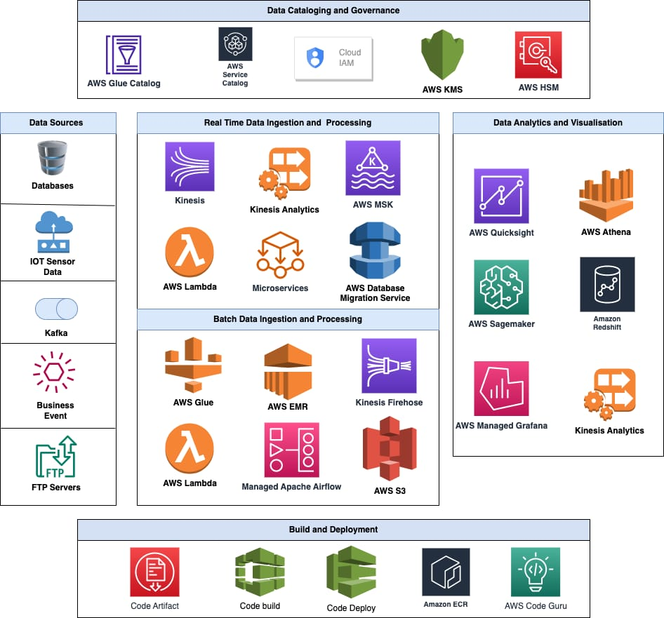

# Data Platform Architecture

As per the problem statement, requirement is to develop as self service data platform that can facilitate
* Data Ingestion
    * Real Time Data Processing
    * Batch Data Processing
* Pipeline Orchestration
* Data Cataloging and Governance
* Migration to managed services
* DevOps Principles
    * IAC 
    * CI/CD
 

* Example aws services that can be used 

### Data Ingestion

For deciding tool to select for data ingestion. It is important to carefully consider various parameters 

1. Data Volume: The amount of data being ingested in terms of the size of the data, the number of records.
2. Data Frequency: It is the frequency at which updated data is received. You can either do the near-real-time replication or go for the batch mode processing, where data is first stored in batches and then moved into the pipelines. 
3. Data Velocity: Rate at which data will be received, ingested or processed
4. Data Format: Format of data that needs to be stored, processed, ingested.

*Real Time Data :*
For data delivery in real time AWS services like Kinesis, Managed Service Kafka, Change Data Capture (CDC on database) that can again write to kinesis and open source tools like Apache Druid, Apache Streampipes can be used and for processing this data in real time either lambda or microservices can be used based on data cadence and data volume.

*Batch Data Porcessing :*
For Batch Data Processing AWS services like lambda (wherein we can define batch size and time to wait for records before processing/ scheduled lambda's), AWS Glue can be used for processing and for near real time data transfer Firehose can also be used in some cases

### Pipeline Orchestration
For Pipeline Orchestration and performing ETL Operations AWS Services like AWS Glue, AWS Step Functions can be used and other open source services like Apache Airflow, DataPlane can help in orchestration of Jobs Where in users can interact using visual workflow diagrammes.
    
### Data Cataloging and Governance
Data Cataloging and Governance is a important part of your Data Platform because as the Data and use case around Data grows, Data teams end up having multiple databases and several jobs running and it becomes challenging to find right asset at right time. For Cataloging AWS Provides services like AWS Service Catalog, AWS Glue Data Catalog and now they have launched a new preview version of AWS Datazone which is meant for cataloging and some open source cataloging tools like OpenMetadata can be helful in this case. 

For Data Governance, Governance should occur at both physical and logical level at physical level like encryption of data which can be done on AWS using services like KMS and logical level by implementing proper IAM roles and polices.

### DevOps Principles
*Infrastructure as Code (IaC):*
Having IAC for infrastructure is necessary so as to ensure reproducibility, consistency, and ease of deployment. To implement IAC AWS provides tools like AWS CloudFormation / AWS CDK whereas other opensource tools like Terraform are also available to be employed 

*CI/CD:*
On AWS CI/CD automation for build, testing,deployment and delivery can be implemented using AWS CodePipeline and AWS CodeBuild whereas services like bitbucket and gitlab also provide option to define CI/CD on their platform. Jenkins is one other tool that is widely used for implementing CI/CD

